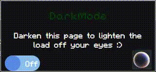
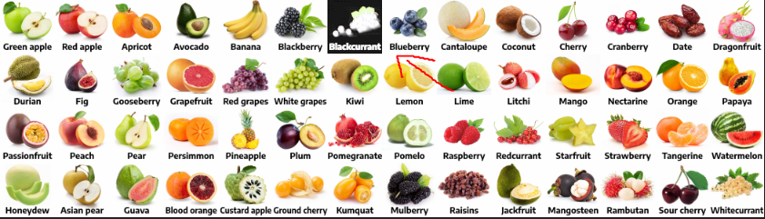
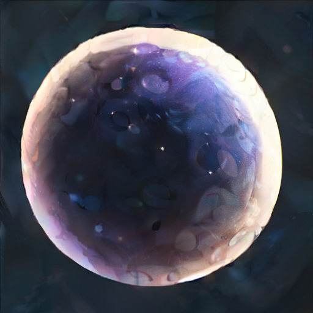
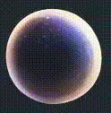

# DarkMode
DarkMode is a simple chrome extension for my own personal use.

  

You can add it from the Chrome extensions store [here]().
# Usage
The On/Off button toggles dark-mode on the current page you're viewing.

The Planet button quickly toggles dark-mode on and off, offering an alternate colour palette to the page.

## Why?
Was there an easier way to achieve the same effect? Yes! Simply enable the 
chrome://flags/#enable-force-dark flag.

## So...
So I started working on this extension initially to fix image elements that broke from the chrome flag:

  

But it turns out you can fix that by changing the chrome flag from <strong>Enabled</strong> to <strong>Enabled with selective inversion of non-image elements</strong>

Seems like I worked on this for nothing right? Well some websites still break here and there, with text becoming unreadable (as the background inverts colour but the text doesnt) which this extension can patch for me!

Despite it all, this was still a good opportunity to practice my Javascript/CSS/HTML skills.

### Fun facts

Fact 1

Did you know the transformations involved in inversing these colours are irreversible? 

Try it out turning the switch on and off! You can also press the planet button if you would like to avoid getting flashbanged.

A neat explanation for why this is the case can be found [here](https://stackoverflow.com/a/19325417).

Fact 2

The icons used in this extension were generated locally on my machine using Stable Diffusion methods. 

Firstly, I generated a simple icon to start off with:

  

Then, I generated a second icon with the first acting as a base:

  

Lastly, I stacked the first image on top of the second. From there it was simple to add an in/out fading animation of the first image image that triggered onclick, revealing the second image hidden underneath. 

This created an effect of the planet 'lighting' when pressed:

  

